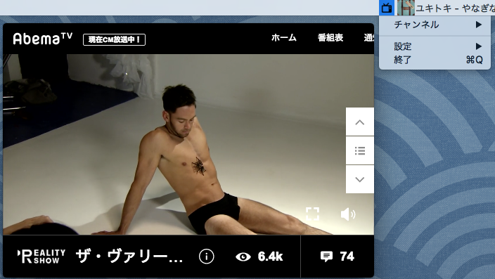

#Abema Viewer

##これは何？

[Abeme TV](https://abema.tv)を快適に見るための専用ビューアです。

[AbemaBrowser](http://www.asahi-net.or.jp/~tz2s-nsmr/abemabrowser.html)に完全にインスパイアされて、[Electron](http://electron.atom.io)で作りました。

##対応 OS

Mac OS X,Windows(Macでしか確認してません).

##スクリーンショット

##機能

- フチなしウィンドウ
- クリックの禁止ができ、誤操作を防げる

##ダウンロード

Downloadをクリック → [Download](https://github.com/veadar/Abema-Viewer/releases)

##参考にさせていただいたコードと使用アイコン

- [AbemaBrowser](http://www.asahi-net.or.jp/~tz2s-nsmr/abemabrowser.html)
- [Electron](http://electron.atom.io)
- [if ( Electron && Windows && フレームレス && 全面ドラッグ移動可 && リサイズ可能) { 設定して欲しいCSS }](http://qiita.com/khsk/items/81982d89d92f88f28e41)
- [30分で出来る、JavaScript (Electron) でデスクトップアプリを作って配布するまで](http://qiita.com/nyanchu/items/15d514d9b9f87e5c0a29)
- [Tv icon](https://www.iconfinder.com/icons/110994/tv_icon#size=512)
- [Mb, tv icon](https://www.iconfinder.com/icons/81047/mb_tv_icon#size=256)